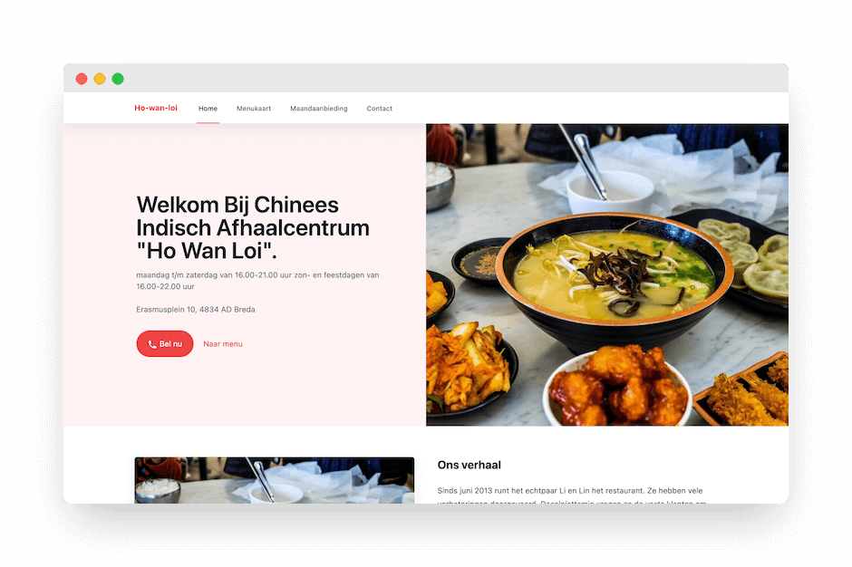
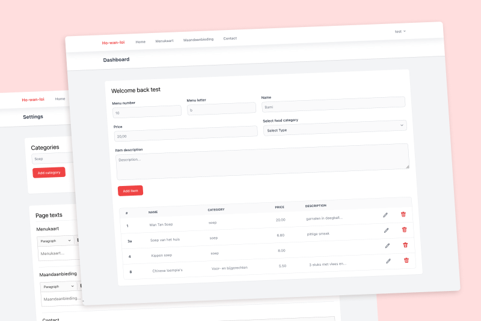

This is a website for the Chinese Indian restaurant [Ho wan loi](https://restaurant-howanloi.nl/). They wanted an online space to show their menu to the customers. I planned to work with someone else who would do the frontend but their schedule didn't allow for this leading me to also do the frontend of the project.



## 🧑🏻‍💻 The code

I've been hearing a lot about [Laravel](https://laravel.com) when around PHP developers who said it was really nice, so I decided to try it out in this project and for the styling we used [Tailwind](https://tailwindcss.com). The customer already had a LAMP(Linux, Apache, MySQL, PHP) web host that they wanted to keep so that all works out to work with Laravel.

To get up and running with Laravel I decided to look at the documentation on the Laravel website, a [tutorial](https://youtu.be/MFh0Fd7BsjE) and in public transit I would check a YouTuber called [Laravel Daily](https://www.youtube.com/c/LaravelDaily) whose code review videos were a great help.

I find that the routing went way smoother than I had in for example my previous non Laravel PHP sites, not to mention the Authentication being included with Laravel. Laravel handles a lot of the standards, allowing me to focus more on the project specifics.

The most important thing on this website is being able to change the menu. As I learned during this project a menu in a Chinese restaurant is ordered by number and letters, this is done because it makes it quicker to write down and makes it easier for foreign cooks to understand. At first, I thought of making the number auto increment or decrement, but that wouldn't work because the physical menu doesn't get updated that quick.

Here is a list of what the menu items needed: 

1. A number
2. A letter
3. Name
4. Price
5. Description
6. A category

To create this in the database, I added a couple of things like `id` and `timestamps` and then wrote a migration for it like so: 

```php
Schema::create('menus', function (Blueprint $table) {
	$table->id();
	$table->integer('number');
	$table->string('letter')
		->nullable(true);
	$table->string('name');
	$table->decimal('price');
	$table->text('description')
		->nullable(true);
	$table->foreignId('category_id')
		->nullable()
		->constrained()
		->nullOnDelete();
	$table->timestamps();
});
```

Besides the dashboard which allows you to add menu items and shows the menu, there also is a settings page where you can create categories and change text for pages.



## 🧑🏻‍🏫 Things I learned

* To create a website with Laravel
* To communicate with customers to get them their desired product

## 📌 Things I would do differently

Something I've been noticing is that I'm eager to try out new technologies, but if I keep doing that, I will only get a surface level understanding of everything. I think it might be a better idea if I would narrow my focus on a couple of things and the fundamental concepts, doing this might also make me more adaptable to learn new stacks.