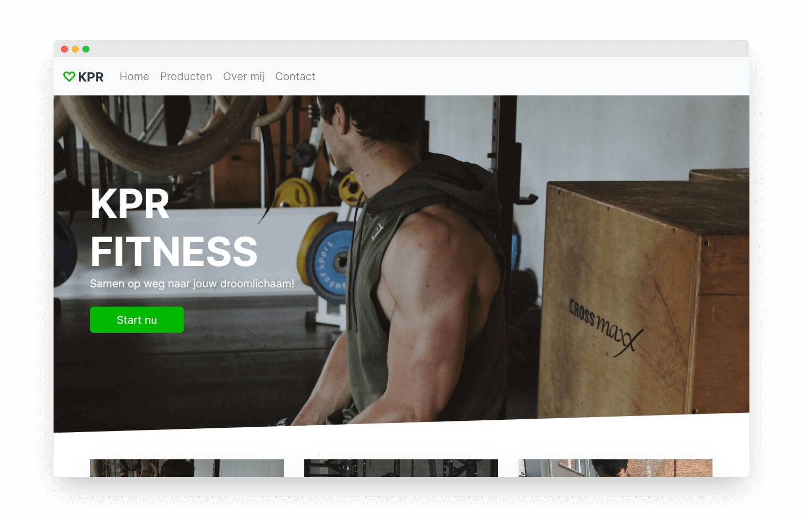
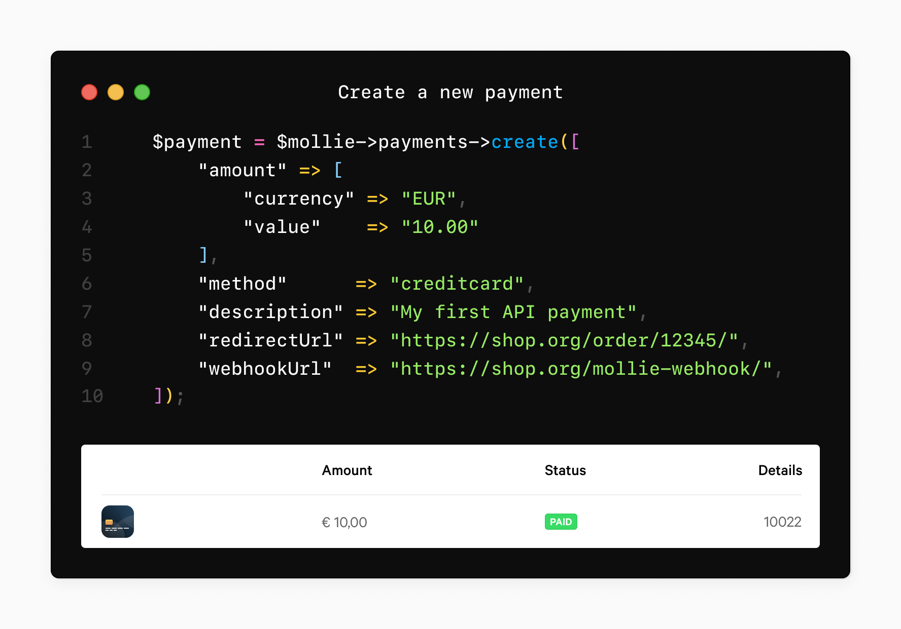

[💾 Check the repository](https://github.com/dylanwe/kprfitness)

KPR-fitness is a site where you can buy personal training, fitness and nutrition programs. This was the first site I made for a real client. Unfortunately the site I made is no longer in use but I had learned a lot from it and decided to share it anyway. This is a screenshot of the home page:

## 🧑🏻‍💻 How I made it

The design is made in Adobe XD and programmed in PHP. I used Bootstrap to make it responsive and used a database to load all the products and make it easier to add new ones.

Payments are made with [Mollie](https://www.mollie.com/uk). Mollie is easy to use and has great documentation. With Mollie I was able to add payments from many Dutch banks and make payment easy and comfortable for the customer. The site is made with PHP which Mollie supports, so paying is as easy as:

## 🧑🏻‍🏫 Things I learned

* Using PHP for displaying items from to database
* Send emails with a contact form using PHP
* Integrate a payment system, in this case with *Mollie*

## 📌 Things I would do differently

* If I had to make this again, I would do the design differently to capture the atmosphere of movement more.
* To improve the user experience, I would add a shopping cart and create an admin panel for the owner with a CMS so that it is easy to add products and change information.