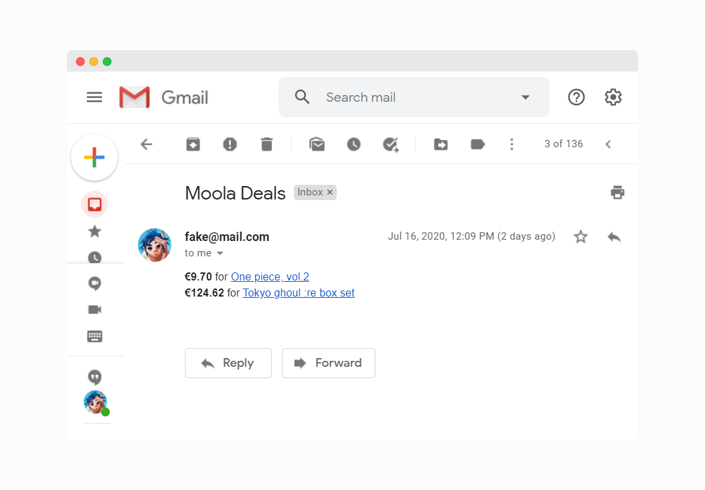

[💾 Check the repository](https://github.com/dylanwe/moola)

Sometimes a product is a little expensive, so you wait for the price to go down, but you feel like you need to check it every day. Well, I've been buying a lot online recently and have come across this problem, and I was looking to make a little project with Node.js and I think I can fix this problem with Node.

What I want to do is add a product to an Excel sheet and set a price desired price for the product. When the product is that price or below, it will send me an E-mail that says what product it is, what price it is, and a link to the product.

## 👨‍💻 How I made it

Someone gave me the idea to get information out of an Excel file. I chose to use Google Sheets because I can use it on every device where I log in, so access is easy.

I use [Sheetsu](https://sheetsu.com) to turn my Google Sheet into an API that I can fetch with Node.js. In my sheet, I fill in a product name, desired price, and a link to the product.

With Node, I fetch the API and loop through the rows and scrape every link to find its price. I then compare each product price to the desired price to check if the price is lower or equal, if that is true I add the product to my mail which will be sent with nodemailer at the end of my foreach loop. This whole process happens once a day on a server.

## 👨‍🏫 What I learned

*  Node.js webscraping with: *request-promise* & *cheerio*
*  Sending E-mails with: *nodemailer*
*  Sort of making an API with: *Sheetsu*
*  How to use environment variables

## 📌 What I would do different

I would rather try to build a proper front-end for the app, and connect it to a database like MongoDB so multiple people can use it.