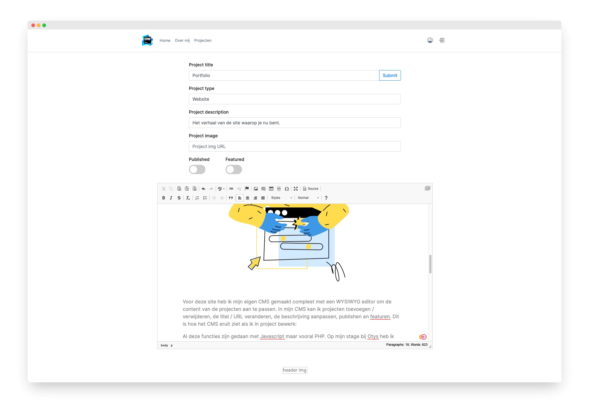

[💾 Check the repository](https://github.com/dylanwe/portfolio-v1)

My first portfolio was inspired by Apple, Medium, Notion and GitHub. Most of these sites have some sort of article layout, I thought it would be useful to do something similar, so I can explain all of my projects.

In general, the website is quite simple, this is because the focus should be mainly on the text.

## 📝 Typography

My chosen font is Inter. I chose Inter because a sans-serif font is easier to read and Inter is also good at a smaller size. The font is long in the x size making it easy to read. Inter also has built-in adjustments when text is next to each other to make it fit better, for example: 9x3 the x in this is different and is shown as a sum.

I made most of the text gray instead of black to make it more comfortable to read. The headers are larger, black and slightly thicker than the normal text, this is to make the hierarchy even clearer in the text.

## 🧑🏻‍💻 Code

For this site I made my own CMS complete with a WYSIWYG editor to adjust the content of the projects. In my CMS I can add / remove projects, change the title / URL, edit the description, publish and feature. This is what the CMS looks like when editing a project:



All these functions are done with Javascript, but especially PHP. During my internship at [Otys](https://www.otys.nl) I was able to learn a lot from the developers, such as making my own CMS and integrating [CKEditor](https://ckeditor.com). They also helped me get started with OOP(Object Oriented Programming) in PHP, an example of that is my Database class, for this I made a database object with methods and instance variables, so that everything that belongs to the database is also worded with Database addressed. An instance variable is something an object knows, and a method is something an object can do.

```php
class Database // <-- class name 
{
    private $host; // <-- instance variable
    private $dbname; // <-- instance variable
    private $username; // <-- instance variable
    private $password; // <-- instance variable
    private $dbConnection; // <-- instance variable

    public function __construct() // <-- method
    {
        $this->host = 'hostname';
        $this->dbname = 'dbname';
        $this->username = 'username';
        $this->password = 'password';
    }

    public function connect() // <-- method
    {
        $this->dbConnection = new PDO("mysql:host=$this->host;dbname=$this->dbname;charset=utf8","$this->username","$this->password");
        return $this;
    }

    public function getPage(string $title) // <-- method
    {
        $db = $this->connect()->dbConnection;
        $exe = $db->prepare("SELECT * FROM content WHERE title='$title';");
        $exe->execute();
        $table = $exe->fetchAll(PDO::FETCH_ASSOC);
        return $table;
    }
}
```

To keep the URLs neat, I used routing, something I learned during this period. With routing I describe what a URL looks like and what stands for what, "content.php?page=work processes" becomes with my routing "content/work processes" this is done through a .HTACCES file.

## 🧑🏻‍🏫 What I Learned

* Rewrites and routing so I keep the URLs neat.
* Using AJAX which allows me to save the content in my WYSIWYG editor without pressing a button.
* Create fewer files by loading pages with the same layout on the same file.
* Uploading files so that I no longer have to log in to the server to add an image.
* Using Object Oriented Programming and MVC to better organize my code.
* Make it more dynamic like the content pages that consist of database information.

## 📌 What I would do differently:

Although I have made a CMS it is not perfect. With my CMS I can't customize the Homepage because it's quite unique content and doesn't fall into a template. During my internship at Otys I found a way in which this could be done and it would be good if I built that into my next portfolio.