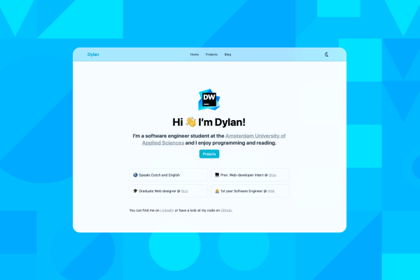

After reading the book "Show your work" I got motivated to rebuild my portfolio to improve the place where I show my work. I had a few requirements for my portfolio:

1. A **CMS**(Content Management System)
2. Write content in **Markdown**
3. **Code blocks**, to present code snippets
4. **React**, to improve my web framework skills
5. **Meta tag customization**, to make pages look more presentable when shared.

With the CMS I want to have the ability to write file in Markdown because it's customizable. I already write notes in it with the tool [Obsidian](https://obsidian.md), meaning that it's easy to convert notes into my portfolio pages.

I want to use React because I like the component-based structure. It's also really popular in the job market, and it will help me in the next year of my study where we will be getting web framework lessons.

Using meta tags allows me to write open graph tags that make my pages more appealing when shared online. It helps other sites like LinkedIn to get some data like an image, title, and description.

## 🎨 The design

I wanted to keep the design simple, but make the text nice and readable. Tailwind has a great option called prose which makes this super easy. The website has a dark mode toggle to reduce eye strain.

## 🧑🏻‍💻 The code

Having put all these requirements down, I came to the conclusion to use Gatsby.js with Netlify CMS and Tailwind for styling. With Gatsby I can write React with the benefit of SEO and markdown pages that will be converted into static HTML, CSS and JavaScript making the loading of the pages fast. Gastby also has the ease of adding in plugins for extra features.

I started out with the [Gatsby starter blog](https://www.gatsbyjs.com/starters/gatsbyjs/gatsby-starter-blog) I experimented with it for quite a bit and then I got to work.

The use of Tailwind to style my website might make the JSX look more cluttered, but it helps the design stay consistent and makes me have to think less about the design.

I had a hard time with Netlify CMS because every customization I wanted on it needed to be published because it doesn't show locally, this is the reason for a lot of commits.

The website is hosted for free on Netlify which is great as I'm a student and would rather spend that little cash on some food 😅. Netlify tracks the main branch on GitHub for updates and then deploys it to the server.

## 🧑🏻‍🏫 Things I learned

* Gatsby
* React components, props and state
* Hosting on Netlify

## 📌 Things I would do differently

The commits I made are quite the mess and sometimes all over. A part of these weird commits are because I had to push code to see changes to the CMS.