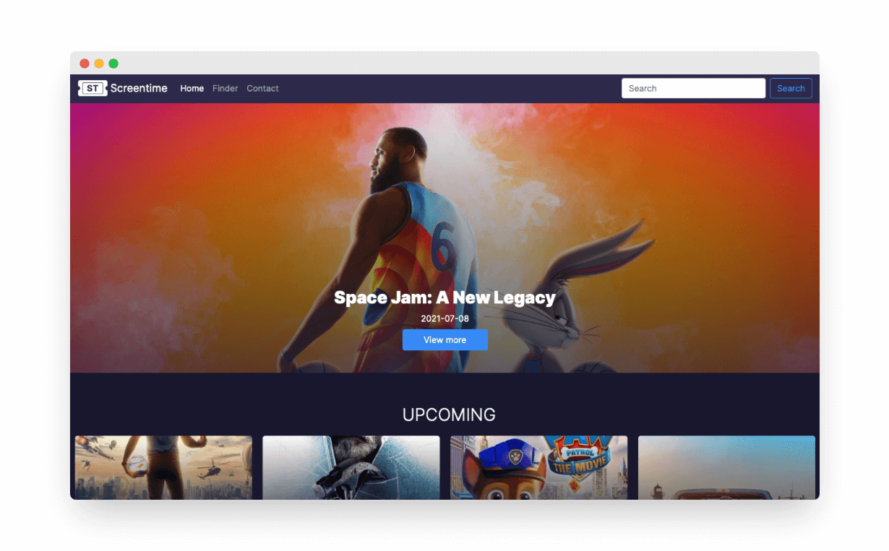

This is a school group project and I did the development a bit. Screen-time is a website where can see information about movies, search movies, and see new releases.



## 👨‍💻 How I made it

The design was made by another student in Adobe XD, and he used a 12 column grid so converting it to a responsive site was pretty easy. The website was made with Bootstrap to get it nice and responsive for every device.

To get all the movie information I used [The Movie DB](https://www.themoviedb.org/) which is an API that can send information about movies and TV shows. The finder page is inspired by Tinder you can press X to continue looking for movies and if you see something interesting you can click on the eye to view more information. It was made with a simple randomizer in JavaScript

## 👨‍🏫 What I learned

It was the first time I learned to use an API. The documentation was great, so I can call new data with ease. 

## 📌 What I would do differently

I would use a fetch to get the API and write getting data into a function that would make it easier to reuse and I won't have to copy code all the time something like this:

```javascript
function fetchMovie(url) {
    fetch(url)
        .then(res => res.json())
        .then(json => console.log(json))
}
```

Something I later found out was [Slick slider](https://kenwheeler.github.io/slick/) which makes adding nice responsive sliders easy. I've experimented with it and I would definitely add it to make browsing movies and shows even better.