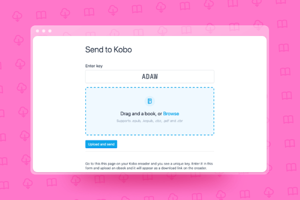
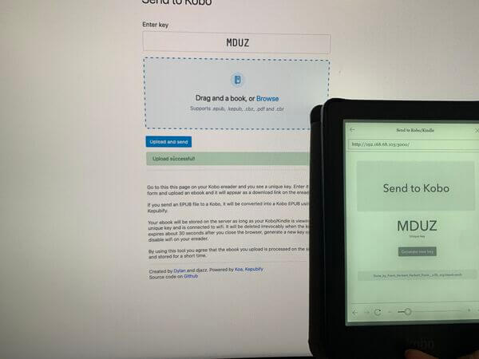

I like to read various things, but sending books to my Kobo e-readers is mostly done through cable. I came along a project on GitHub [repository](https://github.com/daniel-j/send2ereader) that is a website that you can reach on your e-reader and send books. I did however noticed that I couldn't send a .cbz format with the website, so I decided to download it and try to implement. An amazing feature about the site is that it converts .epubs(the most common ebook format) to .kepub(the native version of ebooks on Kobo).

## 🧑🏻‍💻 The code

This wasn't my own codebase, so I had to look around for a while before I could wrap my head around it. A way to get more familiar with the code is refactoring, so I did piece by piece. I abstracted some files away and used an .ejs rendering engine for the pages. After a while, I added TypeScript to help me write clearer code and reduce guessing through type hints.

After a while the code became more and more familiar which is nice and soon enough I made it my own.

To make it easier for others to refactor my code and knowing that fundamental things won't break, I wrote two unit tests:

1. To test if key generation was done in the correct manner.
2. If the transformation from .epub to .kepub went alright.

I also gave the frontend of the website a small redesign with Bootstrap to make the frontend more pleasing.

Here you can see me recieving a book on my e-reader:

## 😅 What went wrong

* The older project uses kindlegen to convert books from .epub to .mobi, but kindlegen seems to have been deleted, so I couldn't download it. Because of this, I had to exclude kindlegen and decided to focus my application purely on Kobo users.
* I wanted to upgrade the client side JavaScript for the download side of the Kobo a bit but the built-in browser seems to be old, not allowing for the ES6 type JavaScript syntax. I thought about writing the client side with jQuery, but I don't feel like a lot of new developers that might want to try and work on my code would want to learn that.
* I wanted to use a realtime database like Firebase to store keys and book locations but that didn't workout because of the old Kobo browser.

## 🧑🏻‍🏫 Things I learned

* Working on someone else's code
* Writing unit tests

## 📌 Things I would do differently

On the receiving end requests are sent every 5 seconds to ensure the session is still active. I think reducing requests through a websocket would reduce the load on the server.